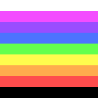
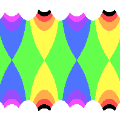
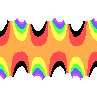

# Symmetrical Pattern Generator
This program lets you transform an image in to an image with symmetrical pattern. Just supply a base image and a formula to get started.

I assume you're comfortable with [Go](https://golang.org/), YAML and a command line. You'll install this in go, write the formulas in YAML, and run this program on the command line to generate patterns.

## Installation
This program is written in [Go](https://golang.org/), so download that first.

`go install` will download the other required libraries:
- yaml
- ginkgo
- gomega
- check

You will also need a source image to generate patterns with. I included one in `source/rainbow_stripe.png`.

## How to run
`make run` Looks for the file `data/formula.yml` to find the source image, the type of pattern to use and other settings.

Rename the `data/formula.yml.example` file to see it in action.

Look over [HERE](docs/common_options.md) to see common options used in every symmetry pattern file.

## Types of patterns
### Rosette
**Rosette** patterns surround the center of the image, expanding outward forever.

p3 symmetry [(Link to source file)](example/rosettes/rainbow_stripe_rosette_1.yml)

p4 symmetry [(Link to source file)](example/rosettes/rainbow_stripe_rosette_2.yml)

p5 symmetry [(Link to source file)](example/rosettes/rainbow_stripe_rosette_3.yml)

### Frieze
**Frieze** patterns expand horizontally forever but usually have a finite height.

p11g symmetry [(Link to source file)](example/friezes/rainbow_stripe_frieze_p11g.yml)

p211 symmetry [(Link to source file)](example/friezes/rainbow_stripe_frieze_p211.yml)

p2mg symmetry [(Link to source file)](example/friezes/rainbow_stripe_frieze_p2mg.yml)

### Lattice
**Lattice** patterns tend to repeat using a given 4 sided shape called a lattice. They expand horizontally and vertically.

Hexagonal lattice with p31m symmetry [(Link to source file)](example/lattices/rainbow_stripe_lattice_hexagonal_p31m.yml) If you look for repeating points, you may be able to make out the 6 solid blue dots surrounding the seventh central point. The underlying lattice can be stacked in a hexagon pattern.

## How to test
- `make test` Runs the unit tests.
- `make lint` Runs the linter

## Inspiration
[Creating Symmetry](https://www.amazon.com/Creating-Symmetry-Mathematics-Wallpaper-Patterns/dp/0691161739) by Frank Farris shows the 
math behind the patterns and inspired me to make this. Prepare for group theory and lots of complex numbers.
