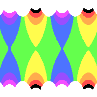

# Symmetrical Pattern Generator
This program lets you transform an image into an image with symmetrical pattern. Just supply a base image and a formula to get started.





I assume you're comfortable with [Go](https://golang.org/), YAML and a command line. You'll install this in Go, write the formulas in YAML, and run `make run` on a command line to generate pretty patterns.

## Important pages
* [Common Options](docs/common_options.md)
* [Rosette Patterns](docs/pattern_rosette.md)
* [Frieze Patterns](docs/pattern_frieze.md)
* [Lattice Patterns](docs/pattern_lattice.md)

## Installation
This program is written in [Go](https://golang.org/), so download that first.

Once that is done, you can use go to get this project for you:
`go get https://github.com/Chadius/creating-symmetry/`

You will need a source image. [A rainbow stripe pattern is included](example/rainbow_stripe.png) in this repository and used throughout these docs.


### Manual Install using go install
If `go get` doesn't work you can check out this repository directly. Then open a terminal and navigate to the folder this code lies in.

Run `go install` and it will download the other required libraries:
- yaml
- ginkgo
- gomega
- check

## How to run

Copy the example formula, and run the program.

```shell script
cp data/formula.yml.example data/formula.yml
make run
```

When you run `make run`, it will generate this [orange and red rosette pattern](#rosette):


You can open `out/example_image.png` to see the results. (on a Mac, you can also type `open out/example_image.png` to open it in Preview.)

### What happened?
This program looks for the file `data/formula.yml` to answer these questions:
- What image do you want to transform?
- How do you want to transform the image?
- Where is the result stored?
The example formula writes your image to `out/example_image.png`.

## Command Line Options
```
  -f string
    	The filename of the formula file. Defaults to ./data/formula.yml (default "formula")
```

## Types of patterns
### Rosette
**Rosette** patterns surround the center of the image, expanding outward. They can be rotated around the center without visually changing the look. 


[3 way rotational symmetry](example/rosettes/rainbow_stripe_rosette_1.yml)


[4 way rotational symmetry](example/rosettes/rainbow_stripe_rosette_2.yml)


[5 way rotational symmetry](example/rosettes/rainbow_stripe_rosette_3.yml)

[Click here](docs/pattern_rosette.md) to learn more about rosette-based patterns and design your own.

### Frieze
**Frieze** patterns expand horizontally forever but usually have a finite height.


[Reflective symmetry across the x-axis](example/friezes/rainbow_stripe_frieze_p11m_and_p11g.yml)


[2 way Rotational symmetry](example/friezes/rainbow_stripe_frieze_p211.yml)


[Glide symmetry: move the pattern horizontally a bit and then flip it over the x-axis](example/friezes/rainbow_stripe_frieze_p2mg.yml)

[Click here](docs/pattern_frieze.md) to learn more about frieze-based patterns and how to build your own.

### Lattice
**Lattice** patterns transform using a 4 sided shape called a lattice. They expand horizontally and vertically forever. Sometimes these are called wallpaper patterns.


[Rectangular lattice](example/lattices/rainbow_stripe_lattice_rectangular_pmg.yml).
The lattice connects the 4 centers of the green and orange ovals. Then the lattice is repeated to create the image.


[Hexagonal lattice](example/lattices/rainbow_stripe_lattice_hexagonal_p31m.yml)
Creates 3 way rotational symmetry. This lattice can be stacked 7 times to create a hexagonal pattern. Count the solid blue dots to see the corners of the lattices.


[Rhombic lattice](example/lattices/rainbow_stripe_lattice_rhombic_cmm.yml)
The lattice is based on a rhombus, where all sides are the same length but not at a square.
All red blobs should look the same, but due to the low resolution rounding errors appear.

[Click here](docs/pattern_lattice.md) to learn more about lattice-based patterns. (Still a Work In Progress!)

## How to test
If you plan to mess around with the code itself, here are 2 more make commands that will come in handy:
- `make test` Runs the unit tests.
- `make lint` Runs the linter.

## Inspiration
<cite>[Creating Symmetry by Frank Farris](https://www.amazon.com/Creating-Symmetry-Mathematics-Wallpaper-Patterns/dp/0691161739)</cite>
merges math and art to create beautiful patterns and is worth the read. Prepare for Group Theory and Complex Numbers!
