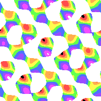

# Generic Lattice
A Generic lattice is a 4 sided polygon with arbitrary non-zero lengths.



[(link to formula)](../../example/lattices/rainbow_stripe_lattice_generic_p1.yml)

# Formula file
To create a formula file, you can either use one of the example formula and modify them, or follow these steps to write it from scratch.

0. Set up your [common options](common_options.md) before adding the formula.
1. Add the lattice pattern header so the program knows you want to make a hexagonal pattern with a desired symmetry.
2. Add one or more wave packets that will shape your pattern (and optionally set up symmetry.)

## Lattice pattern header
You can either copy one of the examples and modify it, or you can follow these instructions:
1. Start the pattern with `lattice_pattern:`
2. Add `lattice_type: generic` as child key/value.
3. Add a `lattice_size` to shape the lattice.
4. Add a `multiplier` with non-zero `real` and `imaginary` keys.
5. (Optional) If you want symmetry, add a `desired_symmetry` key with the notation. (i.e `p31m`, `p3m1`, `p6`, `p6m`)

Note: If the `multiplier`'s `real` or `imaginary` parts are 0, the pattern will flatten into a single color.

## Add a lattice_size
1. Add a `width`. This is a non-zero number. Greater numbers mean skinnier lattices.
1. Add a `height`. This is a non-zero number. Greater numbers mean shorter lattices.

```
lattice_size:
  width: 1.0
  height: 0.6
```

## Add Wave Packets
Every lattice based pattern has one or more wave packets.

1. Each wave packet has a `multiplier`. The multiplier should have non-zero `real` and `imaginary` parts.
2. Now add a list of `terms` objects. If you're using `desired_symmetry`, only add one term per wave packet.
3. Each term must have `power_n` and `power_m`. These are non-zero integers.

# Symmetry
## P1
All lattices have 1 way rotational symmetry. This means if you rotate it 360 degrees it will look just like the original.

If you don't want any other type of symmetry:
- Don't use `desired_symmetry`.
- Make the wave packet multipliers different.
- Change the `power_m` and `power_n` for each term. Make sure another term didn't negate the powers.

## P2


[(link to formula)](../../example/lattices/rainbow_stripe_lattice_generic_p2.yml)

There is only 1 type of optional symmetry: 180-degree rotation.

To create p2 symmetry, add `desired_symmetry: p2` to your `lattice_formula` section.

### Manual formula
For each wave packet, there must a corresponding wave packet. Copy the first wave packet and make these changes:
- The multipliers should stay the same.
- Negate `power_n` and `power_m`.

In other words:
- `power_n = original_power_n * -1`
- `power_m = original_power_m * -1`
