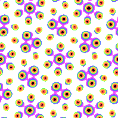

# Hexagonal Lattice
A Hexagonal lattice is a 4 sided polygon tilted at 60 degrees. You can stack 6 of them around a central polygon, forming a hexagon.

Here's a lattice and the underlying hexagonal shape.

# Formula file
To create a formula file, you can either use one of the example formula and modify them, or follow these steps to write it from scratch.

0. Set up your [common options](common_options.md) before adding the formula.
1. Add the lattice pattern header so the program knows you want to make a hexagonal pattern with a desired symmetry.
2. Add one or more wave packets that will shape your pattern (and optionally set up symmetry.)

## Lattice pattern header
You can either copy one of the examples and modify it, or you can follow these instructions:
1. Start the pattern with `lattice_pattern:`
2. Add `lattice_type: hexagonal` as child key/value.
3. Add a `multiplier` with non-zero `real` and `imaginary` keys.
4. (Optional) If you want symmetry, add a `desired_symmetry` key with the notation. (i.e `p31m`, `p3m1`, `p6`, `p6m`)

Note: If the `multiplier`'s `real` or `imaginary` parts are 0, the pattern will flatten into a single color.

## Add Wave Packets
Every lattice based pattern has one or more wave packets.

1. Each wave packet has a `multiplier`. The multiplier should have non-zero `real` and `imaginary` parts.
2. Now add a list of `terms` objects. If you're using `desired_symmetry`, only add one term per wave packet.
3. Each term must have `power_n` and `power_m`. These are non-zero integers.

# Symmetry
## P3
All hexagonal lattices have 3 way rotational symmetry. You can rotate the image 120 degrees in either direction, and it will look the same as the original.

If you don't want any other type of symmetry:
- Don't use `desired_symmetry`.
- Make the wave packet multipliers different.
- Change the `power_m` and `power_n` for each term. Make sure another term didn't swap the order or negate the powers.

## P31m

[(link to formula)](../../example/lattices/rainbow_stripe_lattice_hexagonal_p31m.yml)

You can reflect p31m symmetry around a horizontal axis.

To create p31m symmetry, add `desired_symmetry: p31m` to your `lattice_formula` section.

### Manual formula
For each wave packet, there must a corresponding wave packet. Copy the first wave packet and make these changes:
- The multipliers should stay the same.
- Swap the order of `power_n` and `power_m`.

In other words:
- `power_n = original_power_m`
- `power_m = original_power_n`

## P3m1

[(link to formula)](../../example/lattices/rainbow_stripe_lattice_hexagonal_p3m1.yml)

P3m1 images reflect around a vertical axis, like a book.

To create p3m1 symmetry, add `desired_symmetry: p3m1` to your `lattice_formula` section.

### Manual formula
For each wave packet, there must a corresponding wave packet. Copy the first wave packet and make these changes:
- The multipliers should stay the same.
- Swap the order of `power_n` and `power_m`.
- Negate `power_n` and `power_m`.

In other words:
- `power_n = original_power_m * -1`
- `power_m = original_power_n * -1`

## P6

[(link to formula)](../../example/lattices/rainbow_stripe_lattice_hexagonal_p6.yml)

P6 indicates the image can be rotated 6 times without any visual difference.
So, you can rotate it 60, 120, and 180 degrees in either direction without a visual change. P6 images also have P2 and P3 symmetry.

To create p6 symmetry, add `desired_symmetry: p6` to your `lattice_formula` section.

### Manual formula
For each wave packet, there must a corresponding wave packet. Copy the first wave packet and make these changes:
- The multipliers should stay the same.
- Negate `power_n` and `power_m`.

In other words:
- `power_n = original_power_n * -1`
- `power_m = original_power_m * -1`

## P6m

[(link to formula)](../../example/lattices/rainbow_stripe_lattice_hexagonal_p6m.yml)

P6m images not only have 6 way rotation, but they also reflect.

Compare to the [P6m](#p6) example. The three-pronged balls can fold over a horizontal line while maintaining symmetry.

This still has P6 symmetry, so it has 2, 3 and 6 way rotational symmetry.

To create p6m symmetry, add `desired_symmetry: p6m` to your `lattice_formula` section.

### Manual formula
For each wave packet, there must be **3 corresponding** wave packets.
Copy the first wave packet three times. The multipliers should be the same as the first.

For the second wave packet:
- Negate `power_n` and `power_m`.

For the third wave packet:
- Swap the order of `power_n` and `power_m`.

For the fourth wave packet:
- Swap the order of `power_n` and `power_m`.
- Negate `power_n` and `power_m`.

In other words:
- `wave_packet_2_power_n = original_power_n * -1`
- `wave_packet_2_power_m = original_power_m * -1`

- `wave_packet_3_power_n = original_power_m`
- `wave_packet_3_power_m = original_power_n`

- `wave_packet_4_power_n = original_power_m * -1`
- `wave_packet_4_power_m = original_power_n * -1`
