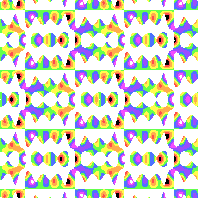
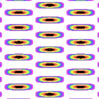

# Rhombic Lattice
A Rhombic lattice is a 4 sided shape with equal sides.
A square is a special type of rhombic lattice, where all 4 sides meet at 90 degree angles. A general rhombus has two pairs of equal angles.


Rhombic lattice with cmm symmetry [(link to formula)](../../example/lattices/rainbow_stripe_lattice_rhombic_cmm.yml)


Here's a lattice and the underlying Rhombic shape.

# Formula file
To create a formula file, you can either use one of the example formula and modify them, or follow these steps to write it from scratch.

0. Set up your [common options](common_options.md) before adding the formula.
1. Add the lattice pattern header so the program knows you want to make a Rhombic pattern with a desired symmetry.
2. Add one or more wave packets that will shape your pattern (and optionally set up symmetry.)

## Lattice pattern header
You can either copy one of the examples and modify it, or you can follow these instructions:
1. Start the pattern with `lattice_pattern:`
2. Add `lattice_type: rhombic` as child key/value.
3. Add a `lattice_size` to shape the lattice.
4. Add a `multiplier` with non-zero `real` and `imaginary` keys.
5. (Optional) If you want symmetry, add a `desired_symmetry` key with the notation. (i.e `p4g`, `p4m`)

Note: If the `multiplier`'s `real` or `imaginary` parts are 0, the pattern will flatten into a single color.

## Add a lattice_size
1. Add a `height`. This is a non-zero number. Greater numbers mean shorter lattices.

```
lattice_size:
  height: 0.6
```

## Add Wave Packets
Every lattice based pattern has one or more wave packets.

1. Each wave packet has a `multiplier`. The multiplier should have non-zero `real` and `imaginary` parts.
2. Now add a list of `terms` objects.
3. Each term must have `power_n` and `power_m`. These are non-zero integers.

# Symmetry
## cm


Rhombic lattice with cm symmetry [(link to formula)](../../example/lattices/rainbow_stripe_lattice_rhombic_cm.yml).

cm patterns have glide symmetry along the x-axis. You can shift the image half a "unit" to the left or right, then reflect over the horizontal line.


To create cm symmetry, add `desired_symmetry: cm` to your `lattice_formula` section.

### Manual formula
For each wave packet, there must a corresponding wave packet. Copy the first wave packet and make these changes:
- The multipliers should stay the same.
- Swap the order of `power_n` and `power_m`.

In other words:
- `power_n = original_power_m`
- `power_m = original_power_n`

## cmm



Rhombic lattice with cmm symmetry [(link to formula)](../../example/lattices/rainbow_stripe_lattice_rhombic_cmm_2.yml).

cmm symmetry have 2 rotation symmetry. They can be rotated 180 degrees without visually changing the image. 
Like cm patterns, cmm patterns also have glide symmetry along the x-axis. So all cmm patterns also have cm symmetry.

To create cmm symmetry, add `desired_symmetry: cmm` to your `lattice_formula` section.

### Manual formula
For each wave packet, there must be **3 corresponding** wave packets.
Copy the first wave packet three times. The multipliers should be the same as the first.

For the second wave packet:
- Negate `power_n` and `power_m`.

For the third wave packet:
- Swap the order of `power_n` and `power_m`.

For the fourth wave packet:
- Swap the order of `power_n` and `power_m`.
- Negate `power_n` and `power_m`.

In other words:
- `wave_packet_2_power_n = original_power_n * -1`
- `wave_packet_2_power_m = original_power_m * -1`

- `wave_packet_3_power_n = original_power_m`
- `wave_packet_3_power_m = original_power_n`

- `wave_packet_4_power_n = original_power_m * -1`
- `wave_packet_4_power_m = original_power_n * -1`
