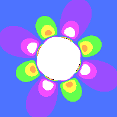
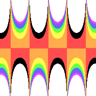

# Where is the formula file located?
By default, this program looks for `data/formula.yml`.
It should contain:
- The name of the [source image](#input-image)
- The [name](#output-filename) and [size](#output-resolution) of the output image
- The [formula](#transformation-formula) that transforms the source into the output
- Numerical ranges used with the formula
  - [sample space](#sample-space)
  - [color value space](#color-value-space)

## How does it work?
1. The input numerical range is used to create input sample space.
2. Using the formula, it transforms the input.
3. The transformed point is used in the color value space to figure out what color each point should take from the source image.

### Example
- We have a `100x100` sample image. 
- We want a `200x200` output image.
- Our formula doubles the given `(x,y)` coordinates.
- The sample space is from `(0,0)` to `(10,10)`.
- Our color value space is from `(0,0)` to `(40,40)`

The sample space will be sampled 200x200 times since that's the resolution of the output image.
So each sample will have a difference of 1/20 from the previous.  

Starting with `(0,0)`:
- The formula doubles the coordinates `(0,0)` to `(0,0)`.
- This falls within the color value space.
- `(0,0)` in the color value space lines up with the top left corner.
- This will draw the same color as the top left corner of the source image.

Next sample is `(1/20,0)`:
- The formula doubles the coordinates `(1/20,0)` to `(2/20,0)`.
- This falls within the color value space.
- `(2/20,0)` in the color value space lines up with somewhere near the top left corner.
- This will draw the same color as near the top left corner of the source image.

Let's look at this sample `(5,2)`: 
- The formula doubles the coordinates `(5,2)` to `(10,4)`.
- This falls within the color value space.
- `(10,4)` in the color value space lines up with somewhere in the top left quadrant.
- This will draw the same color of as the one spot in the top left quadrant of the source image.

The last sample `(10, 10)`:
- The formula doubles the coordinates `(10, 10)` to `(20, 20)`.
- This falls within the color value space.
- `(20,20)` is the center of the color value space.
- This will draw the same color that lies at the center of the source image.

The samples chosen will draw from the top left corner of the source image to the center.
Manipulating the `sample_space` and `color_value_space` will zoom in on different regions.

## Common options
Every formula file contains these options.

### Sample Source Filename
The name of the image file. JPG and PNG are supported, as well as any format Go lang’s `Image` library supports.

Examples:
- `example/rainbow_stripe.png`
- `input/iceCreamSundae.jpg`

### Output Filename
The name of the output filename. All output files are in PNG format.

`ouput/rainbow_stripe_frieze.png`

#### Output Resolution
How big do you want the resulting image?
- Bigger images give more detail.
- Smaller images render faster.

Write an object with `width` and `height` fields, both in pixels.

Examples:
```yaml
output_size:
  width: 500
  height: 300
```

### Sample space
Sample mathematical values in this range. You can think of it as zooming in/out your picture.

Based on the resolution of the output image, it will break the sample space into a number of discrete values.
It starts from `(minx, miny)`, moves in the x direction to `(maxx, miny)`.
Then it goes back to `minx` but moves in the y direction slightly towards `maxy`.
It stops when it reaches `(maxx, maxy)`.

It transforms each discrete sample value using the formula.
Then maps the result against the [color value space](#color-value-space) 
to figure out what color to use from the input image.

What is the “right” input space varies by formula.
- If your range is too small, you may not see the repeating pattern.
- If your range is too large, the formula might converge everything to 0. You'll see mostly one color in your output.
- If your range is too large, the formula might move everything to infinity. In this case nothing will be drawn, and you'll have a transparent output image.

#### Examples
Let's start with a rosette. They tend to have a hole at the center, a ring, and then some more detail around it.
The sample space was selected to capture the "petals" that surround the ring.

```yaml
sample_space:
  minx: -8e-1
  miny: -8e-1
  maxx: 8e-1
  maxy: 8e-1
```



[(Formula)](../example/rosettes/rainbow_stripe_rosette_2.yml)

I want to stretch the horizontal sample space and see more detail.
I will reduce the distance between minx and maxx by half. In exchange for more detail, I don't get to see as much of the overall image.

```yaml
sample_space:
  minx: -4e-1
  miny: -4e-1
  maxx: 8e-1
  maxy: 8e-1
```


[(Link to formula)](../example/rosettes/rainbow_stripe_rosette_2_sample_space_1.yml)

Let's zoom out and see the extremes. Make a large distance between minx and maxx. Same thing for miny and maxy.
It's hard to see anything about the central ring, but now I get to see more of the pattern.

```yaml
sample_space:
  minx: -64e-1
  miny: -64e-1
  maxx: 64e-1
  maxy: 64e-1
```


[(Link to formula)](../example/rosettes/rainbow_stripe_rosette_2_sample_space_2.yml)

### Color value space
The transformed [sample space](#sample-space) rarely lines up with the source image's resolution.

The color value space lets you control which rectangular section of the source image will be used.
You'll need to pay attention to the terminal output to see the absolute ranges of the transformed points.

- Any transformed values near `minx` will use the left side of the source image.
- Any transformed values near `maxx` will use the right side of the source image.
- Any transformed values near `miny` will use the top side of the source image.
- Any transformed values near `maxy` will use the bottom side of the source image.
- Any transformed value that is out of bounds will be transparent.
- Any transformed value that is infinity/undefined will be transparent.

Most transformed values converge around a central point, so you can use the midway point of the color value space to determine the main color of the result.

Like the sample space, there is no “right” color value space.
- If your color value space is too small, the transformed values will fall outside, and you'll have a transparent image.
- If your color value space is too big, the transformed values converged to one point. Your image will be the color of that point.

##### Examples
Color space is easier to explain in one dimension, so these examples focus on `miny` and `maxy`.

Let's take a look at a frieze file. Because `miny` and `maxy` have the same distance from the center, the pattern's main color should be the same as the center of the source image.

The green stripe is at the center, so the frieze pattern should be mostly green.
```yaml
color_value_space:
  minx: -1.1e1
  maxx: 1.1e1
  miny: -1.8e1
  maxy: 1.8e1
```


[(Link to formula)](../example/friezes/rainbow_stripe_frieze_p2mg_alpha.yml)

Let's push the center towards the orange/red part of the source image. That lies near the bottom, so `miny` and `maxy`'s midpoint should be negative.

```yaml
color_value_space:
  minx: -1.1e1
  maxx: 1.1e1
  miny: -2.8e1
  maxy: 0.8e1
```


[(Link to formula)](../example/friezes/rainbow_stripe_frieze_p2mg_sample_space_orange.yml)

Values that fall out of this range become transparent. So if we increase the size of `miny` and `maxy` then more pixels will be drawn.
Note how the valleys and peaks are more extreme.
Also note how the orange stripe is dominant. If we expanded the range more, we would get more orange.

```yaml
color_value_space:
  minx: -1.1e1
  maxx: 1.1e1
  miny: -5.8e1
  maxy: 1.8e1
  ```


[(Link to formula)](../example/friezes/rainbow_stripe_frieze_p2mg_sample_space_extra_thick.yml)

## Transformation Formula
Only one formula will be rendered at a time. Use exactly one of these keys, based on the transformation formula you want:

* [Lattice](pattern_lattice.md)
* [Frieze](pattern_frieze.md)
* [Rosette](pattern_rosette.md)

The formulas are listed in priority order. So if you include multiple, it will look for a lattice formula first, then frieze and finally rosette.