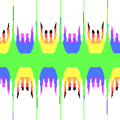

# Formula file
By default, this program looks for `data/formula.yml`. This should contain the settings and the formula of the symmetry pattern you want to make.

## How does it work?
1. This program samples an *input* coordinate from the input space.
2. Then it *transforms* the input.
3. The transformed point is used to figure out what color it should *sample* from the input image.

## Common options
Every formula file contains these options.

### Input image
The name of the image file. JPG and PNG are supported, as well as any format Go lang’s `Image` library supports.

Examples:
`example/rainbow_stripe.png`
`input/iceCreamSundae.jpg`

### Output Resolution
How big do you want the resulting image?
- Bigger images give more detail.
- Smaller images render faster.

Write an object with `width` and `height` fields, both in pixels.

Examples:
```yaml
output_size:
  width: 500
  height: 300
```

### Sample space
Sample mathematical values in this range. You can think of it as zooming in/out your picture.

Symmetry starts from `(minx, miny)`.
It applies the formula you specify and saves the result.
It uses the sample space (see below) to figure out what color it should pick from the input image.

Then it moves on from minx to maxx and applies the formula again. It will sample one row at a time until it reaches `(maxx, maxy)`.

What is the “right” input space varies by formula. If your input space is too large, you may pick uninteresting points that either converge to 0 or escape to infinity (so you’ll get one color or transparency.)

#### Examples
Let's start with a rosette. They tend to have a hole at the center, a ring, and then some more detail around it.
The sample space was selected to capture the "petals" that surround the ring.

```yaml
sample_space:
  minx: -8e-1
  miny: -8e-1
  maxx: 8e-1
  maxy: 8e-1
```


[(Formula)](../example/rosettes/rainbow_stripe_rosette_2.yml)

I want to stretch the horizontal sample space and see more detail.
I will reduce the distance between minx and maxx by half. In exchange for more detail, I don't get to see as much of the overall image.

```yaml
sample_space:
  minx: -4e-1
  miny: -4e-1
  maxx: 8e-1
  maxy: 8e-1
```


[(Link to formula)](../example/rosettes/rainbow_stripe_rosette_2_sample_space_1.yml)

Let's zoom out and see the extremes. Make a large distance between minx and maxx. Same thing for miny and maxy.

```yaml
sample_space:
  minx: -64e-1
  miny: -64e-1
  maxx: 64e-1
  maxy: 64e-1
```


[(Link to formula)](../example/rosettes/rainbow_stripe_rosette_2_sample_space_2.yml)

### Color value space
Each transformed point must correspond to a color from the original image.
With the color value space, you can define how a transformed location will map to a pixel from your original image.
Transformed points close to `minx` will use the left side of the image, while values close to `maxx` will use the right side.
Similarly, `miny` values map to the bottom while `maxy` values map to the top.

If the transformed value is out of bounds, no color is selected and the pixel will be transparent. Similarly, if the transformed value is infinity or undefined it will be transparent.

Most transformed values will be near (0, 0), the center of color value space. You can control the center of the space to decide on the main color of your pattern. 

Like the sample space, there is no “right” color value space.
If your image is mostly transparent, you color value space may be so small everything falls outside of its range and you need to use a larger range.
Conversely if your image is a single color, your color value space may be too large and your results are rounding to the center of the image.

##### Examples
Color space is easier to explain in one dimension, so these examples focus on `miny` and `maxy`.
Also, the source image is a striped pattern, so it doesn't matter what I choose for `minx` and `maxx`.

Let's take a look at a frieze file. Because `miny` and `maxy` have the same distance from the center, the pattern's main color should be the same as the center of the source image.

The green stripe is at the center, so the frieze pattern should be mostly green.
```yaml
color_value_space:
  minx: -1.1e1
  maxx: 1.1e1
  miny: -1.8e1
  maxy: 1.8e1
```



[(Link to formula)](../example/friezes/rainbow_stripe_frieze_p2mg.yml)

Let's push the center towards the orange/red part of the source image. That lies near the bottom, so `miny` and `maxy`'s midpoint should be negative.

```yaml
color_value_space:
  minx: -1.1e1
  maxx: 1.1e1
  miny: -2.8e1
  maxy: 0.8e1
```


[(Link to formula)](../example/friezes/rainbow_stripe_frieze_p2mg_sample_space_orange.yml)

Values that fall out of this range become transparent. So if we increase the size of `miny` and `maxy` then more pixels will be drawn.
Note how the valleys and peaks are more extreme.
Also note how the orange stripe is dominant. If we expanded the range more, we would get more orange.

```yaml
color_value_space:
  minx: -1.1e1
  maxx: 1.1e1
  miny: -5.8e1
  maxy: 1.8e1
  ```


[(Link to formula)](../example/friezes/rainbow_stripe_frieze_p2mg_sample_space_extra_thick.yml)

This pulls the red away from the orange, maybe you don't like a checkerboard pattern.

## Transformation Formula
Only one formula will be rendered at a time. Use exactly one of these keys, based on the transformation formula you want:

* [lattice_formula](docs/pattern_lattice.md)
* [frieze_formula](docs/pattern_frieze.md)
* [rosette_formula](docs/pattern_rosette.md)

The formulas are listed in priority order. So if you include multiple, it will look for a lattice formula first, then frieze and finally rosette.