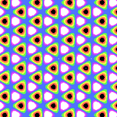
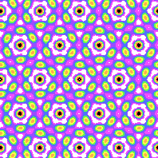

# Hexagonal Lattice
A Hexagonal lattice is a 4 sided polygon tilted at 60 degrees. You can stack 6 of them around a central polygon, forming a hexagon.

- TODO: Show a lattice
- TODO: Show 7 stacked lattices

I drew one lattice and then the surrounding lattices that form the six sided shape.  

# Formula file

# Symmetry
## P3
All hexagonal lattices have 3 way rotational symmetry. You can rotate the image 120 degrees in either direction, and it will look the same as the original.

## P31m

[(link to formula)](../example/lattices/rainbow_stripe_lattice_hexagonal_p31m.yml)

You can reflect P31m symmetry around a horizontal axis.

TODO draw the horizontal axis

TODO show how to automatically set up P31m symmetry

TODO show how to manually set up P31m symmetry

## P3m1

[(link to formula)](../example/lattices/rainbow_stripe_lattice_hexagonal_p3m1.yml)

P3m1 images reflect around a vertical axis, like a book.

TODO draw the vertical axis

TODO show formula secret sauce
TODO show formula manual sauce

## P6

[(link to formula)](../example/lattices/rainbow_stripe_lattice_hexagonal_p6.yml)

P6 indicates the image can be rotated 6 times without any visual difference.
So, you can rotate it 60, 120, and 180 degrees in either direction without a visual change.

P6 images also have P2 and P3 symmetry.

TODO draw the symmetry

TODO show formula secret sauce
TODO show formula manual sauce

## P6m

[(link to formula)](../example/lattices/rainbow_stripe_lattice_hexagonal_p6m.yml)

P6m images not only have 6 way rotation, but they also reflect.

TODO draw the symmetry

TODO show formula secret sauce
TODO show formula manual sauce
