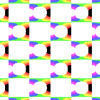
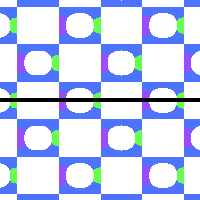
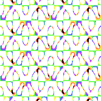
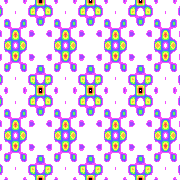
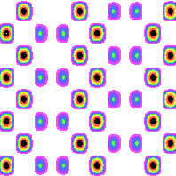
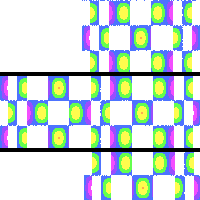

# rectangular Lattice
A rectangular lattice is a 4 sided shape that is aligned with the x and y axes.
A square is a special type of rectangular lattice, where all 4 sides have equal size.


rectangular lattice with cmm symmetry [(link to formula)](../example/lattices/rainbow_stripe_lattice_rectangular_pmg.yml)

TODO Show rectangular lattice

Here's a lattice and the underlying rectangular shape.

# Formula file
To create a formula file, you can either use one of the example formula and modify them, or follow these steps to write it from scratch.

0. Set up your [common options](./common_options.md) before adding the formula.
1. Add the lattice pattern header so the program knows you want to make a rectangular pattern with a desired symmetry.
2. Add one or more wave packets that will shape your pattern (and optionally set up symmetry.)

## Lattice pattern header
You can either copy one of the examples and modify it, or you can follow these instructions:
1. Start the pattern with `lattice_pattern:`
2. Add `lattice_type: rectangular` as child key/value.
3. Add a `lattice_size` to shape the lattice.
4. Add a `multiplier` with non-zero `real` and `imaginary` keys.
5. (Optional) If you want symmetry, add a `desired_symmetry` key with the notation. (i.e `p4g`, `p4m`)

Note: If the `multiplier`'s `real` or `imaginary` parts are 0, the pattern will flatten into a single color.

## Add a lattice_size
1. Add a `height`. This is a non-zero number. Greater numbers mean shorter lattices.

```
lattice_size:
  height: 0.6
```

## Add Wave Packets
Every lattice based pattern has one or more wave packets.

1. Each wave packet has a `multiplier`. The multiplier should have non-zero `real` and `imaginary` parts.
2. Now add a list of `terms` objects. If you're using `desired_symmetry`, only add one term per wave packet.
3. Each term must have `power_n` and `power_m`. These are non-zero integers.

# Symmetry
## pm


Rectangular lattice with pm symmetry [(link to formula)](../example/lattices/rainbow_stripe_lattice_rectangular_pm.yml)

pm symmetry creates horizontal reflective symmetry.
Draw a vertical line from left to right, and you will see the top side is a reflection of the bottom.



To create pm symmetry, add `desired_symmetry: pm` to your `lattice_formula` section.
### Manual formula
For each wave packet, there must a corresponding wave packet. Copy the first wave packet and make these changes:
- Multiplier should stay the same.
- Negate `power_m`.

In other words:
- `power_n = original_power_n`
- `power_m = original_power_m * -1`

## pg


Rectangular lattice with pg symmetry [(link to formula)](../example/lattices/rainbow_stripe_lattice_rectangular_pg.yml)

pg symmetry creates horizontal glide symmetry.
Draw a line from left to right.
Shift the top half about half a unit across.
Now the bottom of the image is a reflection of the top.


To create pg symmetry, add `desired_symmetry: pg` to your `lattice_formula` section.

### Manual formula
For each wave packet, there must a corresponding wave packet. Copy the first wave packet and make these changes:
- IF `power_n` is odd, negate the multiplier. Otherwise, the multiplier should stay the same.
- Negate `power_m`.

In other words:
- `multiplier = original_multiplier * (-1) ^ original_power_n`
- `power_n = original_power_n`
- `power_m = original_power_m * -1`

## pmm


Rectangular lattice with pmm symmetry [(link to formula)](../example/lattices/rainbow_stripe_lattice_rectangular_pmm.yml)

pmm symmetry gives horizontal reflection and p2 rotation.
You can rotate the image 180 degrees without any visual changes.

To create pmm symmetry, add `desired_symmetry: pmm` to your `lattice_formula` section.

### Manual formula
For each wave packet, there must be **3 corresponding** wave packets.
Copy the first wave packet three times. The multipliers should be the same as the first.

For the second wave packet:
- Negate `power_n` and `power_m`.

For the third wave packet:
- Negate `power_n`.

For the fourth wave packet:
- Negate `power_m`.

In other words:
- `wave_packet_2_power_n = original_power_n * -1`
- `wave_packet_2_power_m = original_power_m * -1`

- `wave_packet_3_power_n = original_power_n * -1`
- `wave_packet_3_power_m = original_power_m`

- `wave_packet_4_power_n = original_power_n`
- `wave_packet_4_power_m = original_power_m * -1`

## pmg


Rectangular lattice with pmg symmetry [(link to formula)](../example/lattices/rainbow_stripe_lattice_rectangular_pmg_2.yml)

pmg symmetry gives a horizontal glide and p2 rotation. The next image shows how the horizontal glide works.


You can also rotate the image 180 degrees without any visual changes. Try rotating at any intersection between the red rectangles, or between the two orange squares.

To create pmg symmetry, add `desired_symmetry: pmg` to your `lattice_formula` section.

## pmm and pmg


Rectangular lattice with pmg and pmm symmetry [(link to formula)](../example/lattices/rainbow_stripe_lattice_rectangular_pmg.yml)

If each term's `power_n` is even, the pattern will have pmm and pmg symmetry.

### Manual formula
For each wave packet, there must be **3 corresponding** wave packets.
Copy the first wave packet three times.

For the second wave packet:
- The multiplier should stay the same.
- Negate `power_n` and `power_m`.

For the third wave packet:
- IF `power_n` is odd, negate the multiplier. Otherwise, the multiplier should stay the same.
- Negate `power_m`.

For the fourth wave packet:
- IF `power_n` is odd, negate the multiplier. Otherwise, the multiplier should stay the same.
- Negate `power_n`.

In other words:
- `multiplier = original_multiplier`
- `wave_packet_2_power_n = original_power_n * -1`
- `wave_packet_2_power_m = original_power_m * -1`

- `multiplier = original_multiplier * (-1) ^ original_power_n`
- `wave_packet_3_power_n = original_power_n`
- `wave_packet_3_power_m = original_power_m * -1`

- `multiplier = original_multiplier * (-1) ^ original_power_n`
- `wave_packet_4_power_n = original_power_n * -1`
- `wave_packet_4_power_m = original_power_m`

## pgg


Rectangular lattice with pmg and pmm symmetry [(link to formula)](../example/lattices/rainbow_stripe_lattice_rectangular_pgg.yml)

pgg symmetry gives a horizontal glide and p2 rotation.
Unlike pmg symmetry, there are 2 horizontal glide lines per lattice, giving a different overall shape.



To create pgg symmetry, add `desired_symmetry: pgg` to your `lattice_formula` section.

Some formulas will generate pgg, pm and pmm symmetry.
If each term's `power_n` and `power_m` have an even sum, the pattern will have all of these symmetries.
### Manual formula
For each wave packet, there must be **3 corresponding** wave packets.
Copy the first wave packet three times.

For the second wave packet:
- The multiplier should stay the same.
- Negate `power_n` and `power_m`.

For the third wave packet:
- IF `power_n` plus `power_m` is odd, negate the multiplier. Otherwise, the multiplier should stay the same.
- Negate `power_m`.

For the fourth wave packet:
- IF `power_n` plus `power_m` is odd, negate the multiplier. Otherwise, the multiplier should stay the same.
- Swap the order of `power_n` and `power_m`.
- Negate `power_n`.

In other words:
- `multiplier = original_multiplier`
- `wave_packet_2_power_n = original_power_n * -1`
- `wave_packet_2_power_m = original_power_m * -1`

- `multiplier = original_multiplier * (-1) ^ (original_power_n + original_power_m)`
- `wave_packet_3_power_n = original_power_m`
- `wave_packet_3_power_m = original_power_n`

- `multiplier = original_multiplier * (-1) ^ (original_power_n + original_power_m)`
- `wave_packet_4_power_n = original_power_m * -1`
- `wave_packet_4_power_m = original_power_n * -1`
