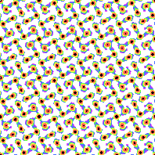
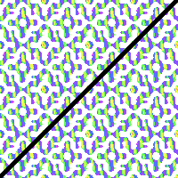
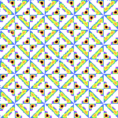
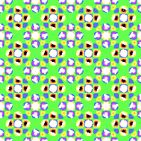

# Square Lattice
A Square lattice is a 4 sided shape with equal sides, aligned with the x and y axes.

Square lattice with p4 symmetry [(link to formula)](../example/lattices/rainbow_stripe_lattice_square_p4.yml).

Here's a lattice and the underlying Square shape.

# Formula file
To create a formula file, you can either use one of the example formula and modify them, or follow these steps to write it from scratch.

0. Set up your [common options](./common_options.md) before adding the formula.
1. Add the lattice pattern header so the program knows you want to make a Square pattern with a desired symmetry.
2. Add one or more wave packets that will shape your pattern (and optionally set up symmetry.)

## Lattice pattern header
You can either copy one of the examples and modify it, or you can follow these instructions:
1. Start the pattern with `lattice_pattern:`
2. Add `lattice_type: Square` as child key/value.
3. Add a `multiplier` with non-zero `real` and `imaginary` keys.
4. (Optional) If you want symmetry, add a `desired_symmetry` key with the notation. (i.e `p4g`, `p4m`)

Note: If the `multiplier`'s `real` or `imaginary` parts are 0, the pattern will flatten into a single color.

## Add Wave Packets
Every lattice based pattern has one or more wave packets.

1. Each wave packet has a `multiplier`. The multiplier should have non-zero `real` and `imaginary` parts.
2. Now add a list of `terms` objects. If you're using `desired_symmetry`, only add one term per wave packet.
3. Each term must have `power_n` and `power_m`. These are non-zero integers.

# Symmetry
## P4
All Square lattices have 4 rotational symmetry. You can rotate the image 90 degrees in either direction, and it will look the same as the original.

If you don't want any other type of symmetry:
- Don't use `desired_symmetry`.
- Make the wave packet multipliers different.
- Change the `power_m` and `power_n` for each term. Make sure another term didn't swap the order or negate the powers.

## P4m

Square lattice with p4m symmetry [(link to formula)](../example/lattices/rainbow_stripe_lattice_square_p4m.yml).

You can reflect p4m symmetry around a diagonal line, from one corner to the other.

To create p4m symmetry, add `desired_symmetry: p4m` to your `lattice_formula` section.

### Manual formula
For each wave packet, there must a corresponding wave packet. Copy the first wave packet and make these changes:
- The multipliers should stay the same.
- Swap the order of `power_n` and `power_m`.

In other words:
- `power_n = original_power_m`
- `power_m = original_power_n`

## P4g

Square lattice with p4g symmetry [(link to formula)](../example/lattices/rainbow_stripe_lattice_square_p4g.yml).

P4g symmetry uses glide symmetry along the diagonal.
This means you can shift the image half a "unit" up a diagonal, then reflect it across the diagonal.
The points will match.

To create p4g symmetry, add `desired_symmetry: p4g` to your `lattice_formula` section.

### Manual formula
For each wave packet, there must a corresponding wave packet. Copy the first wave packet and make these changes:
- IF `power_n` plus `power_m` is odd, negate the multiplier. Otherwise, the multiplier should stay the same.
- Swap the order of `power_n` and `power_m`.

In other words:
- `multiplier = original_multiplier * (-1) ^ (original_power_n + original_power_m)`
- `power_n = original_power_m`
- `power_m = original_power_n`

## p4g and p4m
Some formulas will generate p4g and p4m symmetry. If each term's `power_n` and `power_m` have an even sum, the pattern will have all of these symmetries.

Square lattice with p4m and p4g symmetry [(link to formula)](../example/lattices/rainbow_stripe_lattice_square_p4m.yml).

You can reflect the pattern against the diagonal line to form p4m symmetry.
You can also slide the top along the diagonal until it lines up. You can reflect it across the line to prove you have p4g symmetry. 
