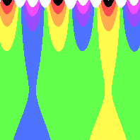

# What is a Frieze pattern?
Window trimmings, Greek and Roman buildings, and rugs have a repeating pattern that moves in one direction. Those are friezes.

When you create Frieze patterns your source picture will be stretched and warped horizontally.

You can skip ahead to the symmetry types you want, or you can read ahead to see the types of symmetry available.
- [p111](#p111)
- [p211](#p211)
- [p1m1](#p1m1)
- [p11m](#p11m)
- [p11g](#p11g)
- [p2mm](#p2mm)
- [p2mg](#p2mg)

# Symmetry Types
## Translational
These types of patterns repeat by just moving to the left or right.
All Frieze patterns have translational symmetry.


[(link to formula)](../example/friezes/rainbow_stripe_frieze_p111_only.yml)

## Reflective
These types look the same if you flip them over a line. Usually you'll see them reflect over the x-axis (so the tops match the bottoms.) 


[(link to formula)](../example/friezes/rainbow_stripe_frieze_p11m_and_p11g.yml)

## Glide
Glides combine translation and reflective features. These translate the top usually by half a unit and reflect over the x-axis.
Often you can get a checkerbooard pattern, like the Orange/Red boxes in this example.


[(Link to formula)](../example/friezes/rainbow_stripe_frieze_p2mg_sample_space_orange.yml)

# Create your Frieze Formula
* Your formula should have a `frieze_formula` key, followed by a list of `terms`.
* Each term's `multiplier` should be non-zero for `real` and `imaginary`. Otherwise, the term tends to degenerate and flatten into a single color.
* Each `term` can include a list of `coefficient_relationships`. This will auto generate more terms with the same multiplier, but different powers.
```yaml
      coefficient_relationships:
        - -M-N
        - "+M+NF(N+M)"
```
* Each `term` must have `power_n` and `power_m`. These are non-zero integers and will help set up your desired symmetry (see "[How to Create Symmetry](#how-to-create-symmetry).")

## How to Create Symmetry
The easiest way is to use `coefficient_relationships` to automatically generate matched pairs.
Set the `power_n` and `power_m` of each `term` to create a term and then add relationships.

There are 7 ways to make symmetrical friezes.
Symmetries are listed using crystallograpic notation.
### p111
p111 is the generic case with no symmetry besides translation.
- Set each term's `Multiplier`, `power_n` and `power_m` to whatever you want.
- Do not include a `coefficient_relationships` section.

If the `Multiplier`s of 2 terms are the same, you may accidentally cause reflection or glide symmetry anyway. To avoid this, you have 2 options:
- Make all `Multiplier`s unique.
- Change the `power_n` and `power_m` of some of the terms. See the "Manual formula" section of the symmetry your pattern triggered.

#### Example


[(link to formula)](../example/friezes/rainbow_stripe_frieze_p111_only.yml)

This pattern only has translational symmetry. You can line up the purple peaks to see how it repeats.

### p211
p211 has rotational symmetry along the center. You can rotate it 180 degrees without visual differences.
Friezes can only have 2 point symmetry since it stretches horizontally forever. 

To create p211 symmetry, add this `coefficient_relationships` field below each term.
```yaml
      coefficient_relationships:
        - -N-M
```

#### Example
This p211 pattern can be rotated 180 degrees without visually changing it.
Note how the purple-white peaks line up correctly.

This pattern has no reflection symmetry. It lacks glide symmetry, as well. If you try to move the top half a unit before reflecting over the x-axis, the white peaks are pointing the wrong way.


[(link to formula)](../example/friezes/rainbow_stripe_frieze_p211.yml)

#### Manual formula
`coefficient_relationships` will take each term and create a new term.
The multiplier is the same, but `power_n` and `power_m` are negated compared to the original term.

So you can forego `coefficient_relationships` and copy the original term.
Keep the multiplier the same, but negate `power_n` and `power_m`.

- `power_n = original_power_n * -1`
- `power_m = original_power_m * -1`

### p1m1
p1m1 has a reflection along a vertical line, like the y-axis.
Imagine putting your pattern in front of a mirror and join its reflection.

To create p1m1 symmetry, add this `coefficient_relationships` field below each term.
```yaml
      coefficient_relationships:
        - +M+N
```
This will create another term with the same multiplier, but swap both `power_n` and `power_m`.

#### Example
This is an example of an image with p1m1 symmetry.
If you draw a horizontal line halfway through the central green valley, you can reflect the pattern.
Notice that the blue bottom extends down infinitely.


[(link to formula)](../example/friezes/rainbow_stripe_frieze_p1m1.yml)

#### Manual formula
To create this pattern manually, you need to add a new corresponding term for each that you have.
The new term should have the same multiplier, but swap `power_m` and `power_n`

- `power_n = original_power_m`
- `power_m = original_power_n`

### p11m
p11m has a reflection along the x-axis.
Imagine you're walking past a reflecting pool and you see your reflection across the bottom.
Notice if the sum of `power_n` and `power_m` is even, you'll also get p11g symmetry.

To create p11m symmetry, add this `coefficient_relationships` field below each term.
```yaml
      coefficient_relationships:
        - -M-N
```

#### Example
##### p11m only
This is an example of an image with p11m symmetry. You can draw a horizontal line across the center and fold it in half.


[(link to formula)](../example/friezes/rainbow_stripe_frieze_p11m_only.yml)

Compare with a [p11g](#p11g-only) pattern, where you cannot reflect it across the x-axis.

##### p11m and p11g
This is an example of an image with p11m and p11g symmetry.
The length of "one unit" is two pairs of blue and yellow pits, so moving it "half a unit" across looks just the same as reflecting it across the x-axis.


[(link to formula)](../example/friezes/rainbow_stripe_frieze_p11m_and_p11g.yml)
#### Manual formula
If you want to create this pattern manually, add another term. Swap and negate both `power_n` and `power_m`.
Multiplier stays the same as the original term.

- `power_n = original_power_m * -1`
- `power_m = original_power_n * -1`

### p11g
p11g showcases glide symmetry.
The top is moved half a unit across, and then mirrored across the x-axis.
Notice if the sum of `power_n` and `power_m` is even, you'll also get p11m symmetry.

To create p11g symmetry, add this `coefficient_relationships` field below each term.
```yaml
      coefficient_relationships:
        - -M-NF(N+M)
```

#### Example
##### p11g only
This is an example of an image with only p11g symmetry.


[(link to formula)](../example/friezes/rainbow_stripe_frieze_p11g_only.yml)

Compare with a [p11m](#p11m-only) pattern, where you can reflect it across the horizontal line in the center.

Compare to a pattern with [p11m and p11g](#p11m-and-p11g) symmetry.

#### Manual formula
If you want to create this manually, add another term. Swap and negate both `power_n` and `power_m`.

The term multiplier will depend on the sum on `power_n` and `power_m`. If the sum is odd, negate the term multiplier. 

So, with math:
- `multiplier = multiplier * (-1 if original_power_n + original_power_m is odd, otherwise)`
- `power_n = original_power_m * -1`
- `power_m = original_power_n * -1`

### p2mm
p2mm has rotational and reflection symmetry.
Start with your pattern, rotate it 180 degrees, and then reflect it along the x-axis. 
It may look like we reflected across both axes. 

To create p2mm symmetry, add this `coefficient_relationships` field below each term.
```yaml
      coefficient_relationships:
        - -N-M
        - +M+N
        - -M-N
```
#### Example
This is an example of an image with only p2mm symmetry. The white centers can be rotated 180 degrees without visually changing the pattern. Or you can reflect it over the y-axis, lined up with those white centers.


[(link to formula)](../example/friezes/rainbow_stripe_frieze_p2mm_only.yml)

Compare to [p2mg only symmetry](#p2mg), which you cannot reflect.

##### p2mm and p2mg
Here is an example of p2mm and p2mg symmetry.
- You can glide the red squares one square across before flipping it over the x-axis.
- You can rotate it at the intersection of the squares.
- You can draw a vertical line at the center of the valley and reflect across it.


[(Link to formula)](../example/friezes/rainbow_stripe_frieze_p2mg_sample_space_orange.yml)

#### Manual formula
Notice if the sum of `power_n` and `power_m` is even, you'll also get p2mg symmetry.

If you want to manually create p2mm symmetry, add 3 terms for each term you created.

- One term negates `power_n` and `power_m`.
- One term will swap `power_n` and `power_m`.
- The final term swaps and negate both `power_n` and `power_m`.

Term 1
- `power_n = original_power_n * -1`
- `power_m = original_power_m * -1`

Term 2
- `power_n = original_power_m`
- `power_m = original_power_n`

Term 3
- `power_n = original_power_m * -1`
- `power_m = original_power_n * -1`

### p2mg
p2mg showcases a glide combined with rotation.
Start with your pattern, rotate it 180 degrees, and then move it half a unit before flipping it over the x-axis.

Notice if the sum of `power_n` and `power_m` is even, you'll also get p2mm symmetry.

To create p2mg symmetry, add this `coefficient_relationships` list below each term.
```yaml
      coefficient_relationships:
        - -N-M
        - +M+NF(N+M)
        - -M-NF(N+M)
```
#### Example
Here's an example of a pattern with only p2mg symmetry:


[(link to formula)](../example/friezes/rainbow_stripe_frieze_p2mg.yml)

You can glide across the x-axis. Move the yellow valley half a unit across, then flip it over. It will look just like the bottom of this pattern.

You can also rotate the pattern right across the center.

Compare to the [p2mm only](#p2mm) pattern, which you can rotate but you can't glide.

You can also refer to a frieze with both [p2mm and p2mg](#p2mm-and-p2mg) symmetry.

#### Manual formula
If you want to manually create p2mm symmetry, add 3 terms.

- One term negates `power_n` and `power_m`.
- One term will swap `power_n` and `power_m`.
- The final term swaps and negate both `power_n` and `power_m`.

The last two terms should negate the multiplier if the sum of `power_n` and `power_m` is odd.

Term 1
- `power_n = original_power_n * -1`
- `power_m = original_power_m * -1`

Term 2
- `multiplier = multiplier * (-1 if original_power_n + original_power_m is odd, otherwise)`
- `power_n = original_power_m`
- `power_m = original_power_n`

Term 3
- `multiplier = multiplier * (-1 if original_power_n + original_power_m is odd, otherwise)`
- `power_n = original_power_m * -1`
- `power_m = original_power_n * -1`

#### IgnoreComplexConjugate (Advanced)
By default, this flag is false.

Rosette and Frieze patterns, by default, will calculate a given point in complex space, as well as its complex conjugate. The conjugate flips the point around the real axis, so the imaginary portion is negated.
Or, `x + iy` becomes `x - iy`.

If set to true, Rosettes and Friezes will only use each given point. This makes patterns much smaller as points tend to zoom off to infinity or become undefined at much smaller values. But the pattern tends to be more compact, with much more varied detail in the middle.

If you want to try this out, include `ignore_complex_conjugate: true` next to each term.

This breaks reflective and glide symmetry, but it does look kind of cool.

##### Example
For an example, let's look back at the p11m/p11g pattern:


[(link to formula)](../example/friezes/rainbow_stripe_frieze_p11m_and_p11g.yml)

Let's add `ignore_complex_conjugate: true` to the term.



[(link to formula)](../example/friezes/rainbow_stripe_frieze_p11m_and_p11g_ignore_complex_conjugate.yml)

Let's zoom out a bit to get all the detail:


[(link to formula)](../example/friezes/rainbow_stripe_frieze_p11m_and_p11g_ignore_complex_conjugate_zoomed.yml)

## Relation to Rosettes
[Rosette patterns](./pattern_rosette.md) are circular and surround a central ring. Imagine picking a side of the ring,
cutting all the way to the outer edge, and then stretching it out until it laid perfectly horizontal. You'd have a frieze pattern.

You may have some fun making a frieze, and then changing the formula to a rosette.


[(link to formula)](../example/friezes/rainbow_stripe_frieze_p11m_only.yml)

And here's the same formula, but now in a rosette pattern.


[(link to formula)](../example/friezes/rainbow_stripe_rosette_based_on_frieze_p11m_only.yml)
