# What is a lattice pattern?
Imagine a 4 sided figure, like a square or rectangle. Tile them on top of each other and to the side.
Now, stretch the source image across those four points. That's a lattice. 

# Symmetry Types
## Translational
All lattice based patterns have translational symmetry.
The lattice is always aligned across 2 axes, so if you scroll the pattern along those directions you will see the pattern repeat.

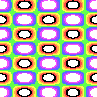

In this example, the axes are horizontal and vertical. You can move up, down, left or right.

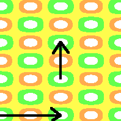

## Reflective
These types look the same if you flip them over a line.
- Some reflective lines are along the x-axis. You can fold the top of the image to the bottom of the image.
- Some reflective lines are along the y-axis. You can fold the left of the image to the right of the image.

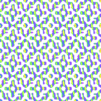

In this example, you can draw a line across the middle, from top to bottom. You'll see the left side matches the right side.

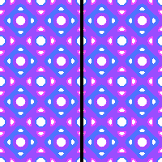

You can also draw a line from left to right. The top matches the bottom.

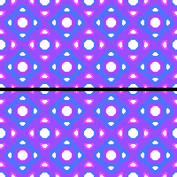

This example also has diagonal reflections.

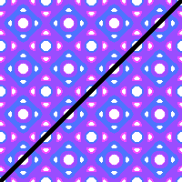

## Rotational
All patterns can be rotated 360 degrees without visual changes.
But some can be rotated at 60, 90, 120 or 180 degrees and look the same.

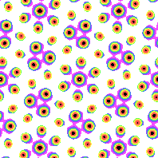

This pattern has 6 way rotational symmetry. Rotate it 60 degrees and the image will look the same.

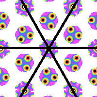

# Lattice types
There are 5 lattice-based patterns that lead to 17 types of symmetry.

## Hexagonal

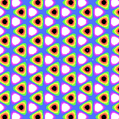

Hexagonal lattice with p31m symmetry [(link to formula)](../example/lattices/rainbow_stripe_lattice_hexagonal_p31m.yml)
The four sided lattice is tilted, so look for the solid blue points. Stacked enough times it connects 7 of them.

Learn more about hexagonal lattices [here.](lattice_hexagonal.md)

## Rectangular

Rectangular lattice with pmg symmetry [(link to formula)](../example/lattices/rainbow_stripe_lattice_rectangular_pmg.yml).
There is a lattice that connects the centers of 4 orange and green rectangles. The lattice is stacked throughout the pattern to make it repeat.

## Square
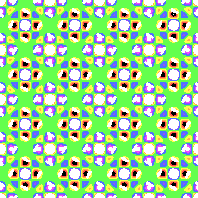

Square lattice with p4m symmetry [(link to formula)](../example/lattices/rainbow_stripe_lattice_square_p4m_and_p4g.yml).
Similar to the rectangular lattice, this lattice meets at right angles and has the same lengths of each side.
Imagine the square's corners inside each of the holes of the purple diamonds, and you'll see the lattice.

You can find out more about Square patterns [here.](lattice_square.md)

## Rhombic
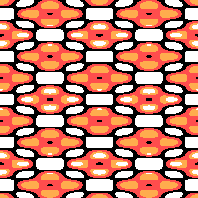

Rhombic lattice with cmm symmetry [(link to formula)](../example/lattices/rainbow_stripe_lattice_rhombic_cmm.yml)
The lattice is based on a rhombus, where all sides are the same length but not at a square. There are rounding errors since the resolution is so small, but all of the red shapes should be exactly the same.

Build your own Rhombic patterns [here.](lattice_rhombic.md)

## Generic
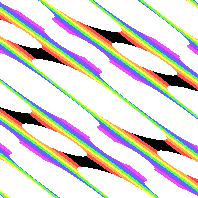

Generic lattice with p2 symmetry [(link to formula)](../example/lattices/rainbow_stripe_lattice_generic_p2.yml)
Generic lattices are freeform. They are guaranteed to be stackable and may have 180-degree symmetrical rotation.

Want to make your own generic lattices? Click [here.](lattice_generic.md)
