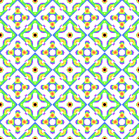
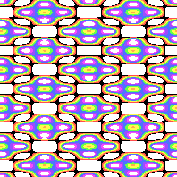

# What is a lattice pattern?
Imagine a 4 sided figure, like a square or rectangle. Tile them on top of each other and to the side.
Now, stretch the source image across those four points. That's a lattice. 

Here are 5 lattice-based patterns.

## Hexagonal

Hexagonal lattice with p31m symmetry [(link to formula)](../example/lattices/rainbow_stripe_lattice_hexagonal_p31m.yml)
The four sided lattice is tilted, so look for the solid blue points. Stacked enough times it connects 7 of them.

More information [HERE](lattice_hexagonal.md)

## Rectangular

Rectangular lattice with pmg symmetry [(link to formula)](../example/lattices/rainbow_stripe_lattice_rectangular_pmg.yml).
There is a lattice that connects the centers of 4 orange and green rectangles. The lattice is stacked throughout the pattern to make it repeat.

## Square

Square lattice with p4m symmetry [(link to formula)](../example/lattices/rainbow_stripe_lattice_square_p4m.yml).
Similar to the rectangular lattice, this lattice meets at right angles and has the same lengths of each side.
Imagine the square's corners inside each of the holes of the purple diamonds and you'll see the lattice.

## Rhombic

Rhombic lattice with cmm symmetry [(link to formula)](../example/lattices/rainbow_stripe_lattice_rhombic_cmm.yml)
The lattice is based on a rhombus, where all sides are the same length but not at a square. There are rounding errors since the resolution is so small, but all of the red shapes should be exactly the same.

## Generic

Grilled cheese, anyone?

Generic lattice with p2 symmetry [(link to formula)](../example/lattices/rainbow_stripe_lattice_generic_p2.yml)
Generic lattices are freeform. They are guaranteed to be stackable and may have 180-degree symmetrical rotation.