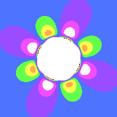
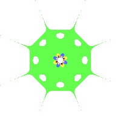
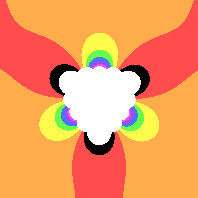
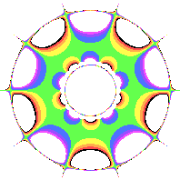

# Rosette

**Rosette** patterns surround the center of the image, expanding outward.

It's like a flower, where several petals surround the core and extend outward.
All rosettes have rotational symmetry.

## Rosette anatomy

### Central Ring
Rosettes have a transparent central ring. For these values, the formula transforms them to either undefined or infinity, and this program can't draw those, so it leaves it transparent. Depending on your color space, you can also change the size of the ring. 

### Petals
Surrounding the ring, you will see some cool details as the original image is warped around the central ring. Flowers have petals surrounding their core, so I'll keep calling these petals.

Here is one example containing purple and green petals surrounding the ring. There are 4 pairs of petals, creating 8 petals total. 



[(link to formula)](../example/rosettes/rainbow_stripe_rosette_2.yml)

### Rosette border
Zooming out will give a smaller ring, but it will also show you how far the pattern can go. At a certain point the formula pushes everything into infinity or undefined values.

In this example, you can see 4 purple smudges on the extremities. You can also see 8 spikes and 8 gaps. Because the color space focuses on the blue stripe of the original image, most of this rosette is blue.  



[(Link to formula)](../example/rosettes/rainbow_stripe_rosette_2_sample_space_2.yml)

This pattern has 4 way rotational symmetry. I can rotate it 90 degrees and it will look exactly the same.

## Rosette Symmetry
All rosettes have rotational symmetry. For example, this pattern has 3 way rotational symmetry. I can rotate it 3 ways without visually changing its look. The red stripes are 120 degrees away from each other.



[(Link to formula)](../example/rosettes/rainbow_stripe_rosette_1.yml)

This diagram has p3 symmetry. The 3 means we can rotate it 3 times without visually changing the image.




[(Link to formula)](../example/rosettes/rainbow_stripe_rosette_3.yml)

Here is an example of p5 symmetry. There are 5 purple petals, 5 yellow petals, and 10 spikes, with 5 pairs of purple and yellow smudges along the edge.

## Making your own Rosette Formula
* Your formula should have a `rosette_formula` key, followed by a series of terms.
* Multiplier should be non-zero for real and imaginary terms.
* You'll need to include these two `coefficient_relationships` values for each term.
```yaml
      coefficient_relationships:
        - -M-N
        - "+M+NF(N+M)"
```
* `power_n` and `power_m` are integers and will help set up your desired symmetry (see "Rotational Symmetry", below.)

### Rotational Symmetry
The powers of n and m are key to making your desired symmetry. Let's say you want pX symmetry, where X is the number of rotations. 

Subtract n from m. The remainder must be divisible by X.

For example, the [(p3 symmetry image)](../example/rosettes/rainbow_stripe_rosette_1.yml) above has only 1 term, with power n of 3 and power m of 0. `3-0 = 3`, and 3 is divisible by 3.  
```yaml
    power_n: 3
    power_m: 0
```

The [(p5 symmetry image)](../example/rosettes/rainbow_stripe_rosette_3.yml) has 3 terms. After subtracting m from n, all of the remainders are a multiple of 5.
`6-1=5`, `8-3=5`, and `10-5=5`. I could have used 11 & 1 for the first term, since `11-1 = 10` and 10 is divisible by 5.

```yaml
      power_n: 6
      power_m: 1
```
```yaml
      power_n: 8
      power_m: 3
```
```yaml
      power_n: 10
      power_m: 5
```

#### IgnoreComplexConjugate (Advanced)
By default, this flag is false.

Rosette and Frieze patterns, by default, will calculate a given point in complex space, as well as its complex conjugate. The conjugate flips the point around the real axis, so the imaginary portion is negated.
Or, `x + iy` becomes `x - iy`.

If set to true, Rosettes and Friezes will only use each given point. This makes patterns much smaller as points tend to zoom off to infinity or become undefined at much smaller values. But the pattern tends to be more compact, with much more varied detail in the middle.

If you want to try this out, include `ignore_complex_conjugate: true` next to each term.