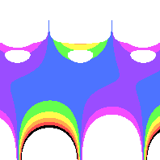
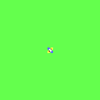
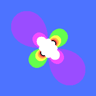
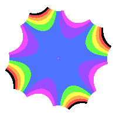

# Rosette

**Rosette** patterns surround the center of the image, expanding outward. 
Like a flower, rosettes have petals surrounding the core.
All rosettes have rotational symmetry.

## Rosette anatomy

### Central Ring
Rosettes have a transparent central ring.

The size of the ring depends on your formula and your color space. 

### Petals
Surrounding the ring, you will see the original image warped around the central ring. I call these petals.

Here is one example containing purple and green petals surrounding the ring. There are 4 pairs of petals, creating 8 petals total. 


[(link to formula)](../example/rosettes/rainbow_stripe_rosette_2.yml)

### Rosette border
Zooming out will show you how the extent of the pattern.

In this example, you can see 4 purple smudges on the extremities. You can also see 8 spikes and 8 gaps. Because the color space focuses on the blue stripe of the original image, most of this rosette is blue.  


[(Link to formula)](../example/rosettes/rainbow_stripe_rosette_2_sample_space_2.yml)

By the way, this pattern has 4 way rotational symmetry. That's why there are 4 or 8 of everything.
I can rotate this image 90 degrees and it will visually look the same, as if I didn't rotate it at all. I can do this 4 times total. The fourth rotation gets me back to the original image.

## Rosette Symmetry
All rosettes have rotational symmetry.
The red stripes are 120 degrees away from each other, 
so I can rotate this 3 times without visually changing it.
The third rotation gets me back to the original orientation.


[(Link to formula)](../example/rosettes/rainbow_stripe_rosette_1.yml)

This diagram has p3 symmetry. The "3" in p3 indicates how many times we can rotate it before returning to our original orientation.


[(Link to formula)](../example/rosettes/rainbow_stripe_rosette_3.yml)

Here is an example of p5 symmetry. There are 5 purple petals, 5 yellow petals, and 10 spikes, with 5 pairs of purple and yellow smudges along the edge.

## Relation to Friezes
[Frieze patterns](./pattern_frieze.md) draw a horizontal pattern that extends forever. Imagine grabbing the left and right
sides, and then folding the frieze so there is a circular gap in the middle. You would make a rosette.

Rosettes and Friezes are mathematically similar, so you might have fun changing a `rosette_formula` to a `frieze_pattern`.
Here is an example rosette:

You may have some fun making a frieze, and then changing the formula to a rosette.


[(link to formula)](../example/rosettes/rainbow_stripe_rosette_2.yml)

And here's the same formula, but now in a frieze pattern.



[(link to formula)](../example/rosettes/rainbow_stripe_frieze_based_on_rosette_2.yml)

## Making your own Rosette Formula
* Your formula should have a `rosette_formula` key, followed by a list of `terms`.
* Each term's `multiplier` should be non-zero for `real` and `imaginary`. Otherwise, the term tends to degenerate and flatten into a single color.
* Each `term` can include a list of `coefficient_relationships`. This will auto generate more terms with the same multiplier, but different powers.
```yaml
      coefficient_relationships:
        - -M-N
        - "+M+NF(N+M)"
```
* Each `term` must have `power_n` and `power_m`. These are non-zero integers and will help set up your desired symmetry (see "[Rotational Symmetry](#rotational-symmetry)", below.)

### Rotational Symmetry
The powers of n and m are key to making your desired symmetry. Let's say you want pX symmetry, where X is the number of rotations. 

Subtract n from m. The remainder must be divisible by X.

For example, the [(p3 symmetry image)](../example/rosettes/rainbow_stripe_rosette_1.yml) above has only 1 term, with power n of 3 and power m of 0. `3-0 = 3`, and 3 is divisible by 3.  
```yaml
    power_n: 3
    power_m: 0
```

The [(p5 symmetry image)](../example/rosettes/rainbow_stripe_rosette_3.yml) has 3 terms. After subtracting m from n, all of the remainders are a multiple of 5.
`6-1=5`, `8-3=5`, and `10-5=5`. I could have used 11 & 1 for the first term, since `11-1 = 10` and 10 is divisible by 5.

```yaml
      power_n: 6
      power_m: 1
```
```yaml
      power_n: 8
      power_m: 3
```
```yaml
      power_n: 10
      power_m: 5
```

#### IgnoreComplexConjugate (Advanced)
By default, this flag is false.

Rosette and Frieze patterns, by default, will calculate a given point in complex space, as well as its complex conjugate. The conjugate flips the point around the real axis, so the imaginary portion is negated.
Or, `x + iy` becomes `x - iy`.

If set to true, Rosettes and Friezes will only use each given point. This makes patterns much smaller as points tend to zoom off to infinity or become undefined at much smaller values. But the pattern tends to be more compact, with much more varied detail in the middle.

If you want to try this out, include `ignore_complex_conjugate: true` next to each term.

As an example, I turned the flag on for the blue p4 pattern and nothing else. Note how the ring only has 2 pairs petals, so this pattern is now p2 instead of p4.


[(Original pattern that uses the Complex Conjugate)](../example/rosettes/rainbow_stripe_rosette_2.yml)



[(Ignore Complex Conjugate is set to True)](../example/rosettes/rainbow_stripe_rosette_2_ignore_complex_conjugate.yml)



[(Close up on the ring and petals)](../example/rosettes/rainbow_stripe_rosette_2_ignore_complex_conjugate_ring.yml)



[(Zoomed out to show the borders of the image)](../example/rosettes/rainbow_stripe_rosette_2_ignore_complex_conjugate_border.yml)
